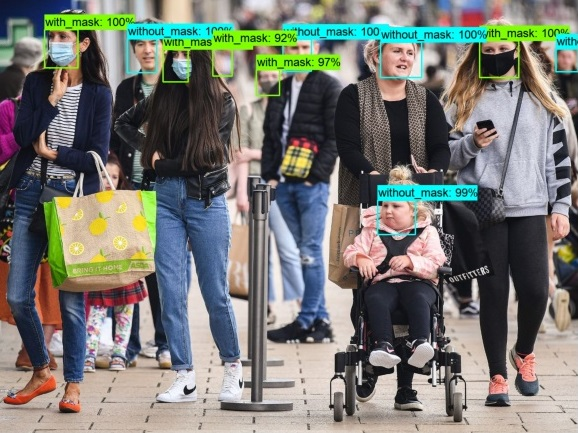
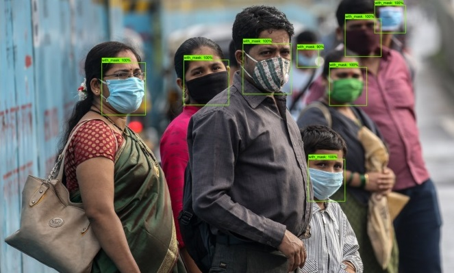
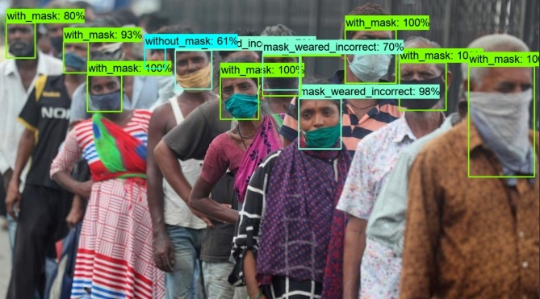
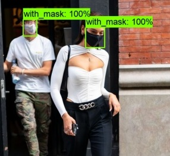
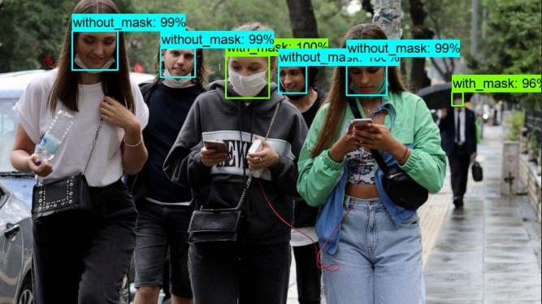
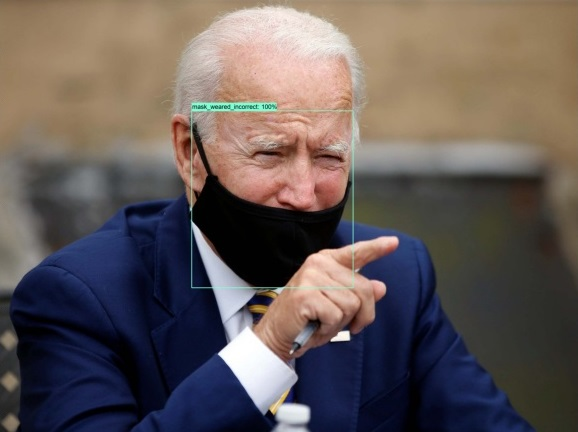
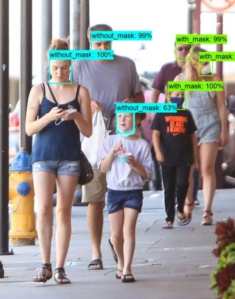
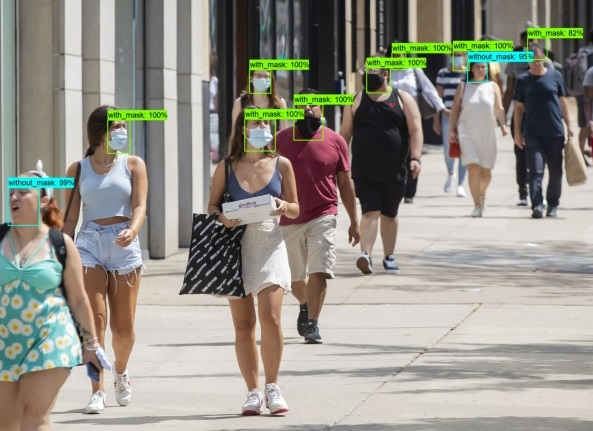
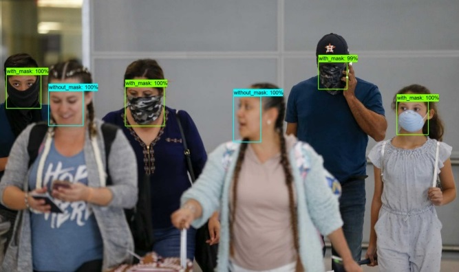
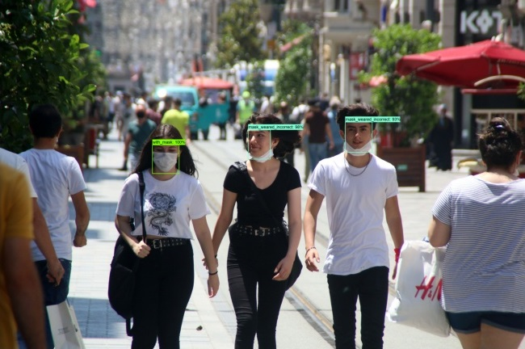

## Training Object Detection Classifier for Mask Recognition using TensorFlow

It is created using TensorFlow's Object Detection API to train object detection classifier for face mask detection in COVID-19.  
The model has been trained on <b>Google Colab with GPU</b> and the runtime was approximately <b>2-3 hours.</b>  
TensorFlow already provides several object detection models (pre-trained classifiers with specific neural network architectures) in its [model zoo](https://github.com/tensorflow/models/blob/master/research/object_detection/g3doc/tf1_detection_zoo.md). I re-trained my model on <b>Faster-RCNN-Inception-V2-COCO</b> since this project works with images and I preferred to go for higher accuracy. The SDD-MobileNet model seems better for faster fps in videos but underperforms when it comes to accuracy.  

<b>The model detects the users with typically 3 categories: </b>

|S.No.|Label|Color|
|:--:|:---:|:---:|
| 1  |with_mask             |  |
| 2  | without_mask         |  | 
| 3  | mask_weared_incorrect|  |  

## Outputs

  

 

  

 

 

## <i>How to test your own images ?</i>
<b>1. Download my repository to a location you remember. (*Use git clone or Download ZIP*) </b>   
<b>2. Setup a virtual environment. </b> (*I have used anaconda for this project with python 3.7 to maintain compatibility with tensorflow*)   
&emsp;`conda create -n mask_detection python=3.7` 
&emsp;`conda activate mask_detection` 

<b>3. Install libraries in virtual environment. </b>(Use either *a* or *b*)  
&emsp;`conda activate mask_detection` 
&emsp;`cd Mask-Detection`  
&emsp; <b>a. Use the commands below : </b><b>(*DO NOT use TensorFlow 2.x</b> as it has compatibilty issues with some existing libraries!*) 
&emsp;&emsp;`pip install TensorFlow==1.15 lxml pillow matplotlib jupyter contextlib2 cython tf_slim`  
&emsp;&emsp;`pip install "git+https://github.com/philferriere/cocoapi.git#egg=pycocotools&subdirectory=PythonAPI"`   
&emsp; <b>b. Install using requirements.txt: </b>
&emsp;&emsp;`pip install -r requirements.txt` 

<b>4. Launch Jupyter Notebook by typing : `jupyter notebook`   </b>
<b>5. Open Mask_Detection.ipynb. </b>  
&emsp;i. You need to put the absolute path of <b>Mask_Detection</b> folder in `INITIAL_DIR=''` variable  
&emsp;ii. Put the images you want to try inside the <b>test_images</b> folder inside <b>Mask_Detection</b> 
&emsp;*Currently, the absolute path is for INITIAL_DIR as `C:/Users/Raghu/Mask-Detection` which is where I saved the repository*  
<b>6. The outputs will be shown or saved to the Outputs folder.</b>
